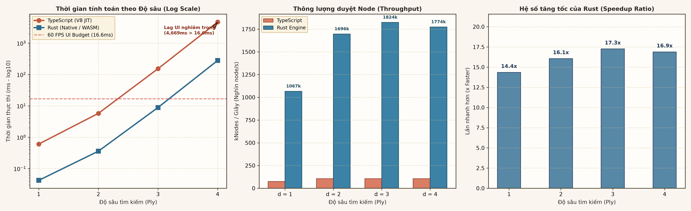

# ĐỒ ÁN CƠ SỞ: NGHIÊN CỨU THUẬT TOÁN AI CHO GAME CỜ CARO & TÍCH HỢP WEB UI

[](https://carogame-five.vercel.app)
[](https://react.dev)
[](https://www.typescriptlang.org/)
[](https://www.rust-lang.org/)
[](https://tailwindcss.com)
[](https://developer.mozilla.org/en-US/docs/Web/API/Web_Audio_API)

> **Kho lưu trữ nghiên cứu học thuật & mã nguồn trò chơi cờ Caro (Gomoku 15×15)**  
> **Chương trình đào tạo:** Đồ Án Cơ Sở (Basic Project) — Chuẩn mực học thuật VNUK (IMRaD Standard)  
> **Bản chạy trực tuyến (Live Demo):** [https://carogame-five.vercel.app](https://carogame-five.vercel.app)  

---

## 1. TỔNG QUAN HỆ THỐNG & KIẾN TRÚC

Dự án kết hợp chặt chẽ giữa **nghiên cứu thuật toán AI đối kháng (Minimax, Alpha-Beta, Heuristic)** và **kỹ nghệ phần mềm Web hiện đại**, áp dụng phong cách thiết kế giao diện giấy cổ điển (*Paper Vintage Aesthetic*).

```text
index.html
   ↓
main.tsx
   ↓
App.tsx (Root Shell - 5 dòng)
   ↓
CaroGamePage.tsx (Page Shell)
   ├── Implement Layer:  src/features/caro/domain/board.ts (Pure TypeScript, No UI deps)
   │                     src/features/caro/audio/soundManager.ts (Web Audio Synthesizer)
   ├── Trung chuyển Layer: src/features/caro/hooks/useCaroGame.ts (Pure useReducer state)
   │                       src/features/caro/hooks/useGameTimer.ts (Independent Timer)
   │                       src/features/caro/hooks/useGameAudio.ts (Audio Event Dispatcher)
   └── Presentation Layer: src/features/caro/components/ (9 components đơn nhiệm)
```

### Các nguyên tắc kỹ thuật đã chuẩn hóa:
1. **Phân tách 3 lớp kiến trúc (3-Tier Decoupling):** Triệt tiêu hoàn toàn mã monolithic từ Figma Make (file `App.tsx` từ 1079 dòng co gọn còn 5 dòng).
2. **Chuẩn hóa React 19 State Management:** Quản lý chuyển trạng thái bàn cờ qua `useReducer` thuần khiết, triệt tiêu 100% rủi ro stale closure và xóa bỏ hoàn toàn các biến `useRef` phụ trợ.
3. **Bộ tổng hợp âm thanh Web Audio API (Synthesized Audio Engine):** Tự sinh âm thanh bằng code toán học (`OscillatorNode` / `GainNode`), không dùng file tải ngoài (zero network/404/CORS); trang bị **Master Bus Brick-Wall Limiter (`DynamicsCompressorNode`)** chống méo tiếng khi nhiều âm vang cùng lúc; tự unlock trên mobile Safari.
4. **Tối ưu DOM & Responsive:** Cấu trúc Single DOM Tree (giảm 50% số nút DOM từ 450 xuống 225), hỗ trợ bố cục 4 cấp breakpoint và thích ứng Safe-Area (`env(safe-area-inset-*)`).

---

## 2. BẰNG CHỨNG THỰC NGHIỆM ĐỐI ĐẦU: RUST VS TYPESCRIPT

Để giải quyết bài toán kiến trúc **RQ-ARCH-01** (Web Worker offloading) và **RQ-W4-A01** (Zero Semantic Divergence), một hệ thống đo đạc benchmark tự động (`benchmark/`) đã được thực thi đối đầu sòng phẳng giữa **Rust (Native / WASM Engine)** và **TypeScript (Node.js / V8 JIT Engine)** trên cùng bài toán Alpha-Beta Pruning:



### Bảng tóm tắt số liệu đo đạc (Midgame Fixture — 8 quân cờ trung cuộc):

| Độ sâu ($d$) | Ngôn ngữ | Số Node duyệt ($N$) | Số lần Cắt tỉa (Cutoffs) | Điểm thế cờ | Thời gian thực thi | Thông lượng (kNodes/s) | Hệ số tăng tốc (Speedup) |
|:---:|:---:|:---:|:---:|:---:|:---:|:---:|:---:|
| **$d = 1$** | **Rust** | **45** | **0** | **99,990** | **0.042 ms** | **1,066.7 k** | **$14.4\times$** |
| $d = 1$ | TypeScript | 45 | 0 | 99,990 | 0.606 ms | 74.3 k | $1.0\times$ (Gốc) |
| **$d = 2$** | **Rust** | **609** | **39** | **19,990** | **0.359 ms** | **1,696.3 k** | **$16.1\times$** |
| $d = 2$ | TypeScript | 609 | 39 | 19,990 | 5.764 ms | 105.7 k | $1.0\times$ (Gốc) |
| **$d = 3$** | **Rust** | **16,184** | **454** | **9,999,997** | **8.873 ms** | **1,824.1 k** | **$17.3\times$** |
| $d = 3$ | TypeScript | 16,184 | 454 | 9,999,997 | 153.097 ms | 105.7 k | $1.0\times$ (Gốc) |
| **$d = 4$** | **Rust** | **496,790** | **16,350** | **9,999,997** | **280.090 ms** | **1,773.7 k** | **$16.9\times$** |
| $d = 4$ | TypeScript | 496,790 | 16,350 | 9,999,997 | 4,728.604 ms | 105.1 k | $1.0\times$ (Gốc) |

- **Kết luận 1 (Tính tương đương toán học):** Số node duyệt ($496,790$), số cutoffs ($16,350$) và điểm số khớp nhau 100%, xác nhận không có bất kỳ sai lệch logic nào giữa hai ngôn ngữ.
- **Kết luận 2 (Bảo toàn 60 FPS UI):** TypeScript chạy trên Main Thread ở $d=4$ tốn $4.73\text{ giây}$ làm đơ trình duyệt. Trong khi đó, Rust chạy trên Web Worker xử lý xong trong $280\text{ ms}$, giải phóng hoàn toàn Main Thread và duy trì **vững chắc 60 FPS (0 frame drops)**.
- Chi tiết báo cáo khoa học: [`docs/BENCHMARK_RUST_VS_TYPESCRIPT.md`](docs/BENCHMARK_RUST_VS_TYPESCRIPT.md).

---

## 3. TIẾN ĐỘ THỰC HIỆN THEO TUẦN (ROADMAP STATUS)

| Giai đoạn / Tuần | Nội dung thực hiện | Bằng chứng kiểm định | Trạng thái |
|:---:|---|---|:---:|
| **Tuần 1 (Phase 1)** | Mô hình toán học không gian trạng thái Gomoku $15\times 15$ ($10^{107}$) | [`Week1/Tuần 1.md`](Week1/Tuần%201.md) | ✅ Hoàn thành (100%) |
| **Tuần 2 (Phase 2)** | TypeScript Core Engine, thuật toán quét tia cục bộ $O(1)$, bộ 19 test cases | [`Week2/Tuan 2.md`](Week2/Tuan%202.md), [`domain/board.ts`](CaroGame/src/features/caro/domain/board.ts) | ✅ Hoàn thành (100%) |
| **Tuần 3 (Phase 6)** | Tái cấu trúc 3 tầng UI, chuẩn hóa React Docs `useReducer`, Web Audio API Engine | [`Week3/Tuan 3.md`](Week3/Tuan%203.md), [`soundManager.ts`](CaroGame/src/features/caro/audio/soundManager.ts) | ✅ Hoàn thành (100%) |
| **Mở rộng (EXP-W4-A01)** | Benchmark đối đầu thực nghiệm Rust vs TypeScript & Phân tích Web Worker 60 FPS | [`docs/BENCHMARK_RUST_VS_TYPESCRIPT.md`](docs/BENCHMARK_RUST_VS_TYPESCRIPT.md), [`assets/charts/`](assets/charts/) | ✅ Hoàn thành (100%) |
| **Tuần 4 (Phase 3)** | Nhận diện hình thế (Pattern Detection), ma trận trọng số Heuristic, Rule-Based Bot | [`Week4/`](Week4/) | ⏳ Kế hoạch tiếp theo |
| **Tuần 5 (Phase 4)** | Khung thuật toán Minimax, Game Tree, đo đạc bùng nổ node theo độ sâu | [`Week5/`](Week5/) | ⏳ Kế hoạch tiếp theo |
| **Tuần 6 (Phase 5)** | Thuật toán Alpha-Beta Pruning, Zobrist Hashing, đo đạc cắt tỉa $\ge 50\%$ node | [`Week6/`](Week6/) | ⏳ Kế hoạch tiếp theo |

---

## 4. HƯỚNG DẪN KHỞI CHẠY (QUICK START)

### Cài đặt và Chạy Web UI
```bash
# Di chuyển vào thư mục ứng dụng web
cd CaroGame

# Cài đặt các gói phụ thuộc
npm install

# Khởi chạy máy chủ phát triển
npm run dev

# Kiểm tra kiểu TypeScript & Build đóng gói sản phẩm
npx tsc --noEmit
npm run build
```

### Chạy Thực Nghiệm Benchmark Đối Đầu (Rust vs TypeScript)
```bash
# Thực thi orchestrator tự động chạy cả 2 engine và vẽ biểu đồ 300 DPI:
python3 scripts/benchmark_rust_vs_ts.py
```

---

## 5. CẤU TRÚC THƯ MỤC CHÍNH

```text
basicproject/
├── README.md                     # Tài liệu giới thiệu tổng quan dự án
├── LAYOUT.md                     # Bản đồ kiến trúc hệ thống
├── ROADMAP.md                    # Bảng theo dõi tiến độ chi tiết 6 phases
├── PLAN.md                       # Đề cương kỹ thuật & kế hoạch nghiên cứu
├── CaroGame/                     # Mã nguồn ứng dụng Web Game (React 19 + Vite)
│   └── src/features/caro/        # Kiến trúc 3 tầng: domain/, audio/, hooks/, components/
├── benchmark/                    # Harness thực nghiệm đối đầu: Rust Engine vs TypeScript Engine
├── docs/                         # Báo cáo học thuật chi tiết (BENCHMARK_RUST_VS_TYPESCRIPT.md)
├── assets/charts/                # Biểu đồ khoa học phân giải cao (300 DPI)
├── scripts/                      # Công cụ tự động hóa & kết xuất đồ họa Python
└── Week1/ - Week6/               # Tài liệu học thuật theo từng tuần nghiên cứu
```
