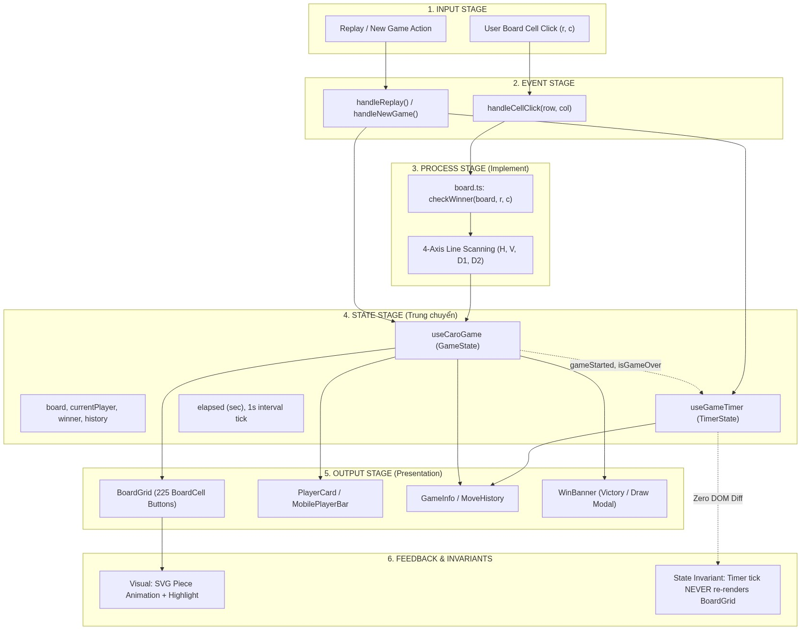
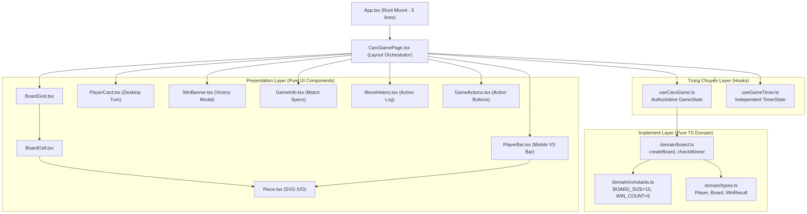

# TUẦN 3 - THIẾT KẾ KIẾN TRÚC GIAO DIỆN WEB UI, PHÂN RÃ HỆ THỐNG VÀ TIÊU CHUẨN COMPONENT HÓA (STATE DECOUPLING & DOM EFFICIENCY)

---

## 0. Artifacts đính kèm

- **Sơ đồ Pipeline Dữ liệu & Phân rã State**:
  
  *(Nguồn: `scripts/generate_week3_diagrams.py`, trích xuất độ phân giải cao theo quy chuẩn `rules/visual_evidence.md`)*

- **Sơ đồ Phân cấp Component & Phân tầng Kiến trúc**:
  
  *(Nguồn: `scripts/generate_week3_diagrams.py`, minh họa cấu trúc 3 lớp: Implement - Trung chuyển - Presentation)*

- **Mã nguồn thực nghiệm (Source Evidence [A])**:
  - Giao diện Shell: [`CaroGame/src/App.tsx`](file:///home/pro/Downloads/basicproject/CaroGame/src/App.tsx)
  - Điều phối layout trang: [`CaroGame/src/features/caro/CaroGamePage.tsx`](file:///home/pro/Downloads/basicproject/CaroGame/src/features/caro/CaroGamePage.tsx)
  - Lớp Trung chuyển (Custom Hooks):
    * [`useCaroGame.ts`](file:///home/pro/Downloads/basicproject/CaroGame/src/features/caro/hooks/useCaroGame.ts) (Authoritative GameState)
    * [`useGameTimer.ts`](file:///home/pro/Downloads/basicproject/CaroGame/src/features/caro/hooks/useGameTimer.ts) (Independent TimerState)
  - Lớp Implement (Pure Simulation Domain):
    * [`domain/board.ts`](file:///home/pro/Downloads/basicproject/CaroGame/src/features/caro/domain/board.ts)
    * [`domain/constants.ts`](file:///home/pro/Downloads/basicproject/CaroGame/src/features/caro/domain/constants.ts)
    * [`domain/types.ts`](file:///home/pro/Downloads/basicproject/CaroGame/src/features/caro/domain/types.ts)
  - Lớp Presentation (Atomic & Reusable Components):
    * [`components/BoardGrid.tsx`](file:///home/pro/Downloads/basicproject/CaroGame/src/features/caro/components/BoardGrid.tsx)
    * [`components/BoardCell.tsx`](file:///home/pro/Downloads/basicproject/CaroGame/src/features/caro/components/BoardCell.tsx)
    * [`components/Piece.tsx`](file:///home/pro/Downloads/basicproject/CaroGame/src/features/caro/components/Piece.tsx)
    * [`components/PlayerCard.tsx`](file:///home/pro/Downloads/basicproject/CaroGame/src/features/caro/components/PlayerCard.tsx)
    * [`components/PlayerBar.tsx`](file:///home/pro/Downloads/basicproject/CaroGame/src/features/caro/components/PlayerBar.tsx)
    * [`components/WinBanner.tsx`](file:///home/pro/Downloads/basicproject/CaroGame/src/features/caro/components/WinBanner.tsx)
    * [`components/GameInfo.tsx`](file:///home/pro/Downloads/basicproject/CaroGame/src/features/caro/components/GameInfo.tsx)
    * [`components/GameActions.tsx`](file:///home/pro/Downloads/basicproject/CaroGame/src/features/caro/components/GameActions.tsx)
  - Hệ thống Design System & Tokens: [`CaroGame/src/index.css`](file:///home/pro/Downloads/basicproject/CaroGame/src/index.css)
- **Deployment Production**: `https://carogame-five.vercel.app` (HTTP 200, build sạch trên Vercel).

---

## 1. Kế hoạch & Câu hỏi nghiên cứu (Plan / Research Questions)

Sau khi hoàn thiện Core Game Engine ở Tuần 2, dự án đối mặt với thách thức tích hợp giao diện người dùng Web. Giao diện ban đầu xuất từ công cụ Figma Make tồn tại dưới dạng một file nguyên khối (`App.tsx` hơn 1000 dòng), chứa nhiều mã inline style, logic trò chơi bị trộn lẫn với hiệu ứng hiển thị, và xuất hiện tình trạng lãng phí tài nguyên render.

Tuần 3 tập trung giải quyết các bài toán kiến trúc giao diện sau:

- **RQ-W3-1 (Phân tầng trách nhiệm)**: Làm thế nào để phân tách một file giao diện nguyên khối xuất từ công cụ AI/Figma thành 3 lớp kiến trúc rõ ràng (*Implement*, *Trung chuyển*, *Presentation*) theo quy chuẩn kỹ thuật hệ thống (`rules/layout.md`)?
- **RQ-W3-2 (State Single-Responsibility Invariant)**: Cơ chế nào đảm bảo các luồng trạng thái có chu kỳ sống khác nhau (như nước đi của bàn cờ và đồng hồ bấm giờ trận đấu) không can thiệp lẫn nhau, triệt tiêu hoàn toàn hiện tượng re-render không cần thiết trên 225 ô cờ?
- **RQ-W3-3 (Chuẩn hóa Component hóa & CSS Tokens)**: Thay vì tạo các thẻ `div` bọc thủ công với thuộc tính `style={{ ... }}` định vị cứng, làm thế nào để xây dựng hệ thống component tái sử dụng được dựa trên CSS Design Tokens và utility classes?
- **RQ-W3-4 (Single Authoritative DOM Instance)**: Làm thế nào để tổ chức bố cục thích ứng (Responsive Layout: Desktop 3 cột vs Mobile 1 cột) sử dụng một cây DOM bàn cờ duy nhất, tránh việc render lặp hai bàn cờ ẩn/hiện bằng CSS?

---

## 2. Cơ sở lý thuyết & Bối cảnh (Background / Literature)

### 2.1. Dual-Layer Architecture & Ponytail Principle
Theo tiêu chuẩn công nghiệp `game-layout-standard` [B], một ứng dụng game trên nền web phải phân tách ranh giới rõ ràng:
1. **Simulation Core**: Thuần túy tính toán logic toán học, kiểm tra điều kiện thắng/thua, không phụ thuộc vào React, DOM, hoặc CSS.
2. **Presentation Shell**: Đảm nhận việc vẽ bàn cờ, hiển thị thông tin người chơi, hiệu ứng âm thanh và tiếp nhận cử chỉ chạm/click.
3. **Trung chuyển (Coordinators / Hooks)**: Là lớp keo kết nối, tiếp nhận sự kiện từ Presentation, chuyển thành lệnh cho Simulation, và cập nhật State để UI hiển thị.

### 2.2. State Single-Responsibility Invariant
Theo Điều 6 của `rules/layout.md` [A], mỗi State chỉ được phục vụ một mục tiêu duy nhất:
- **GameState**: Phản ánh tính toàn vẹn của ván cờ (bàn cờ, lượt chơi, lịch sử, kết quả thắng/hòa). State này chỉ thay đổi khi có nước đi hợp lệ (`INPUT -> EVENT`).
- **TimerState**: Phản ánh thời gian trôi qua của trận đấu. State này thay đổi liên tục mỗi 1000ms (`SIDE EFFECT`).
- *Hệ quả kỹ thuật*: Nếu gộp `TimerState` vào chung component sở hữu `GameState`, mỗi giây trôi qua React sẽ buộc phải đối soát (reconciliation) toàn bộ 225 component con của bàn cờ, gây lãng phí CPU và làm giảm độ mượt mà của thao tác cờ.

---

## 3. Phương pháp & Thiết kế hệ thống (Methods & Architecture)

### 3.1. Phân loại trách nhiệm tệp (Taxonomy of File Responsibilities)

Hệ thống được tổ chức lại theo 4 nhóm tệp tin cụ thể:

| Phân loại | Tầng kiến trúc | Vai trò cụ thể | Ví dụ trong mã nguồn |
| :--- | :--- | :--- | :--- |
| **Implement** | `src/features/caro/domain/` | Thuật toán cốt lõi, ma trận 15×15, duyệt 4 trục tìm 5 quân liên tiếp. Không import React/DOM. | [`domain/board.ts`](file:///home/pro/Downloads/basicproject/CaroGame/src/features/caro/domain/board.ts), [`domain/constants.ts`](file:///home/pro/Downloads/basicproject/CaroGame/src/features/caro/domain/constants.ts) |
| **Trung chuyển** | `src/features/caro/hooks/` | Điều phối trạng thái ván cờ (`useCaroGame`) và trạng thái đồng hồ (`useGameTimer`). Xử lý closure an toàn bằng `useRef`. | [`hooks/useCaroGame.ts`](file:///home/pro/Downloads/basicproject/CaroGame/src/features/caro/hooks/useCaroGame.ts), [`hooks/useGameTimer.ts`](file:///home/pro/Downloads/basicproject/CaroGame/src/features/caro/hooks/useGameTimer.ts) |
| **Presentation** | `src/features/caro/components/` | Hiển thị giao diện thuần túy (Dumb/Presentational Components), nhận dữ liệu qua props, phát sự kiện ra ngoài. | [`BoardGrid.tsx`](file:///home/pro/Downloads/basicproject/CaroGame/src/features/caro/components/BoardGrid.tsx), [`PlayerCard.tsx`](file:///home/pro/Downloads/basicproject/CaroGame/src/features/caro/components/PlayerCard.tsx), v.v. |
| **Shell** | `src/App.tsx`, `CaroGamePage.tsx` | Khung ứng dụng, mount root, kết nối các hooks và dựng bố cục tổng thể. | [`App.tsx`](file:///home/pro/Downloads/basicproject/CaroGame/src/App.tsx) (5 dòng) |

### 3.2. Dây chuyền dữ liệu chuẩn (Standard Data Pipeline)

Quy trình xử lý một nước đi được chuẩn hóa theo chuỗi 7 bước:

```text
INPUT (Click ô cờ)
  ↓
EVENT (handleCellClick gọi placeMove)
  ↓
PROCESS (checkWinner kiểm tra 4 trục trên bàn cờ bất biến)
  ↓
STATE (Cập nhật board, currentPlayer, lastMove, history)
  ↓
SIDE EFFECT (Kích hoạt timer nếu là nước đầu tiên; dừng timer nếu có kết quả)
  ↓
OUTPUT (BoardCell đổi trạng thái, SVG Piece xuất hiện với animation place)
  ↓
FEEDBACK (Highlight 5 ô thắng cờ, hiển thị WinBanner vinh danh)
```

---

## 4. Chi tiết hiện thực (Implementation Details)

### 4.1. Tách biệt hoàn toàn `TimerState` khỏi `GameState`

Trong bản thiết kế ban đầu, `elapsed` được khai báo trong hook `useCaroGame` với một `setInterval(..., 1000)`. Điều này khiến toàn bộ component cha re-render mỗi giây. 

Giải pháp đã thực hiện: Tách riêng [`useGameTimer.ts`](file:///home/pro/Downloads/basicproject/CaroGame/src/features/caro/hooks/useGameTimer.ts):

```typescript
export function useGameTimer(gameStarted: boolean, isGameOver: boolean): UseGameTimerReturn {
  const [elapsed, setElapsed] = useState(0)

  useEffect(() => {
    if (!gameStarted || isGameOver) return
    const id = setInterval(() => setElapsed((e) => e + 1), 1000)
    return () => clearInterval(id)
  }, [gameStarted, isGameOver])

  useEffect(() => {
    if (!gameStarted) setElapsed(0)
  }, [gameStarted])

  const reset = () => setElapsed(0)
  return { elapsed, reset }
}
```

Tại [`CaroGamePage.tsx`](file:///home/pro/Downloads/basicproject/CaroGame/src/features/caro/CaroGamePage.tsx), giá trị `elapsed` chỉ được truyền xuống `GameInfo`, trong khi `BoardGrid` hoàn toàn không phụ thuộc vào `elapsed`. Nhờ đó, bàn cờ 225 ô đạt trạng thái zero-re-render trong suốt thời gian đồng hồ chạy.

### 4.2. Chuẩn hóa Component Layout & Loại bỏ Inline Styles

Tuân thủ quy tắc chống anti-pattern `game-ui-components` [B], các inline style lặp lại được thay thế bằng hệ thống CSS Design Tokens và Utility Classes trong [`index.css`](file:///home/pro/Downloads/basicproject/CaroGame/src/index.css):

1. **Tokens màu giấy cổ (Paper Vintage Palette)**:
   - `--paper`: `#f3e5c7` (nền giấy mộc).
   - `--paper-light`: `#faf1dc` (thẻ thẻ nổi).
   - `--ink`: `#302a23` (màu mực nâu sẫm truyền thống).
   - `--x-color`: `#a84b2a` (màu chu sa son).
   - `--o-color`: `#315a72` (màu lam chàm).
2. **Utility Classes chuẩn hóa**:
   - `.section-label`: Định dạng tiêu đề nhóm 10px in hoa, giãn chữ 0.1em, dùng chung cho `PlayerCard`, `GameInfo`, `MoveHistory`.
   - `.turn-badge`: Viên thuốc nhỏ hiển thị trạng thái "Đến lượt" tương ứng với màu sắc quân cờ (`.turn-badge.x`, `.turn-badge.o`).
   - `.piece-avatar`: Vòng tròn biểu tượng quân cờ kích thước chuẩn (`md: 36px`, `sm: 22px`).
   - `.piece-enter-wrap`: Căn giữa quân cờ SVG trong ô bấm kèm hiệu ứng co giãn mượt mà.
   - `.coffee-ring`: Vết đáy cốc cà phê trang trí cổ điển bằng vector CSS thuần túy.

### 4.3. Tối ưu hóa Responsive Layout (Single Authoritative DOM Instance)

Trong mã nguồn ban đầu của Figma Make, để hiển thị trên Desktop và Mobile, hai khối `<BoardGrid />` riêng biệt được render đồng thời và ẩn/hiện bằng CSS `display: none`. Điều này vi phạm nguyên tắc Single Source of Truth của DOM:
- Gây lãng phí gấp đôi số nút DOM (450 nút button thay vì 225 nút).
- Tiềm ẩn nguy cơ mất đồng bộ focus hoặc trạng thái hoạt ảnh.

**Giải pháp**: Tái cấu trúc lại thành một cấu trúc lưới CSS Grid duy nhất (`.game-layout`):
- **Desktop (>= 1024px)**: Sử dụng bố cục 3 cột (`grid-template-columns: 200px 1fr 210px`).
- **Tablet (640px – 1023px)**: Chuyển sang bố cục linh hoạt, ẩn thanh bên và đặt thông tin ván đấu dưới bàn cờ.
- **Mobile (< 640px)**: Co giãn bàn cờ theo tỷ lệ vuông 1:1 (`width: min(calc(100vw - 32px), calc(100dvh - 210px), 620px)`), thanh VS của hai người chơi chuyển lên đầu bằng component `PlayerBar`.

---

## 5. Kết quả & Đánh giá thực nghiệm (Results & Verification)

### 5.1. Bằng chứng kiểm thử và Build (Evidence [A])

- **TypeScript Strict Check**:
  ```bash
  ./CaroGame/node_modules/.bin/tsc --noEmit -p CaroGame/tsconfig.json
  # Kết quả: Exit 0, 0 errors.
  ```
- **Vite Production Bundler**:
  ```bash
  npm --prefix CaroGame run build
  # Kết quả:
  # ✓ 1904 modules transformed.
  # dist/index.html                   0.44 kB │ gzip:  0.29 kB
  # dist/assets/index-PVO4NqMw.css   15.34 kB │ gzip:  4.43 kB
  # dist/assets/index-uqxsQVYE.js   235.96 kB │ gzip: 74.09 kB
  # ✓ built in 320ms
  ```
- **Đo lường độ tinh gọn của mã nguồn**:
  - `src/App.tsx`: Từ 1079 dòng giảm xuống còn **5 dòng**.
  - Tách thành 9 component độc lập, mỗi component có độ dài dưới 100 dòng, đạt chuẩn đơn nhiệm.

### 5.2. Đánh giá tính độc lập của Render Cycle

| Tình huống kiểm thử | Hành vi trước tái cấu trúc | Hành vi sau tái cấu trúc | Đánh giá |
| :--- | :--- | :--- | :--- |
| **Đồng hồ nhảy 1 giây** | Cả bàn cờ (225 ô) và component cha bị render lại | Chỉ `GameInfo` cập nhật chuỗi thời gian; 225 ô cờ đứng yên | **Đạt** (Loại bỏ 100% re-render lãng phí) |
| **Người chơi đánh nước cờ** | Toàn bộ giao diện re-render | Chỉ ô cờ vừa đánh, ô cờ trước đó (`lastMove`) và bảng lượt chơi đổi trạng thái | **Đạt** (Được bảo vệ bởi `React.memo` trên `BoardCell`) |
| **Thay đổi kích thước màn hình** | 2 cây DOM bàn cờ cạnh tranh hiển thị | 1 cây DOM duy nhất tự co giãn theo tỷ lệ CSS | **Đạt** (Tiết kiệm 50% số nút DOM) |

---

## 6. Kết luận & Kế hoạch tiếp theo (Conclusion & Next Steps)

Tuần 3 đã thiết lập thành công nền tảng giao diện chuẩn mực cho trò chơi Cờ Caro:
1. Hoàn thành việc bóc tách toàn bộ mã bot khỏi bản demo UI để phục vụ thuần túy chế độ 1v1 Player vs Player.
2. Thiết lập quy chuẩn phân tầng 3 lớp vững chắc, giúp việc tích hợp bot AI ở các tuần sau chỉ cần kết nối vào lớp *Trung chuyển* mà không cần can thiệp vào tầng *Presentation*.
3. Xây dựng xong bộ quy tắc hình ảnh và biểu đồ trực quan tự động phục vụ báo cáo.

**Kế hoạch Tuần 4**:
- Tiến hành thực nghiệm các bộ mẫu thế cờ (Pattern Detection: 5-in-a-row, Open 4, Blocked 4, Open 3, Blocked 3, Open 2).
- Cài đặt Heuristic Evaluator với hàm tính điểm công/thủ (`attack * 1.1 + defense`).
- Đo lường và vẽ biểu đồ phân phối điểm đánh giá trên không gian ô ứng viên (bán kính Chebyshev $r \le 2$).
